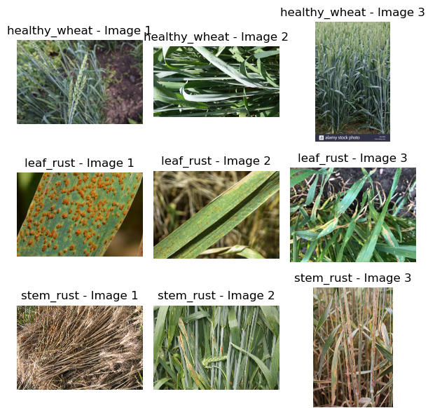
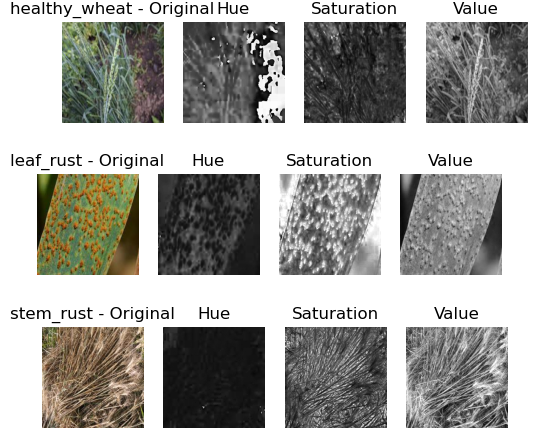
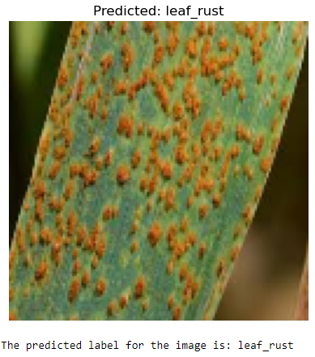
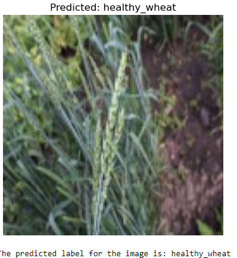
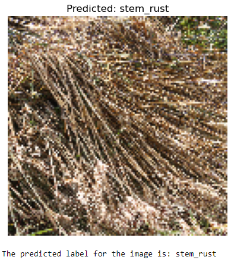

# rust-detection-aerial-ground-ml
Plant disease detection using aerial and ground-level image data with feature extraction techniques (Springer publication)
# Rust Detection using Aerial and Ground-Level Image Data

This project presents a machine learning-based approach for detecting leaf and stem rust diseases using both aerial and ground-level image data.

## 📄 Publication
**Title:** Integrating Aerial and Ground-Level Image Data for Leaf and Stem Rust Detection  
**Conference:** Springer – Intelligent Computing and Technologies (2026)  
🔗 [Read Paper (DOI)](https://doi.org/10.1007/978-3-032-10250-8_33)

## Note : The published paper is also uploaded above.

## 🚀 Overview
This system combines aerial and ground-level imagery to improve disease detection accuracy in agricultural environments.

- Detects leaf rust and stem rust in crops
- Uses dual-perspective data for better accuracy
- Supports scalable monitoring of large agricultural fields

## 🧠 Methodology
- Image preprocessing (resizing, normalization)
- Feature extraction:
  - Color features (HSV)
  - Texture features (GLCM)
- Feature combination and dimensionality reduction (PCA)
- Machine learning models:
  - Random Forest (best performing)
  - Support Vector Machine (SVM)
  - K-Nearest Neighbors (KNN)

## 📊 Results
- Achieved ~99% accuracy using Random Forest model
- Outperformed other ML models in classification performance
- Efficient compared to deep learning approaches (lower computation)

## 📂 Dataset
📊 [CGIAR Crop Disease Dataset](https://www.kaggle.com/datasets/shadabhussain/cgiar-computer-vision-for-crop-disease)

## 🛠 Tech Stack
Python, OpenCV, Scikit-learn, NumPy, Pandas

## 💻 Code
- Jupyter Notebook: `rust_detection.ipynb`
- Python Script: `main.py`

## 📸 Sample Results

### Dataset Samples

### HSV Feature Extraction

### Model Prediction
### Leaf rust

### Healthy 

### Stem rust

## 📦 Note
Due to size limitations, dataset and model files are not included in this repository.

## 🔗 Future Work
- Integration with deep learning models (CNN)
- Real-time deployment for farmers
- Multi-crop disease detection system
